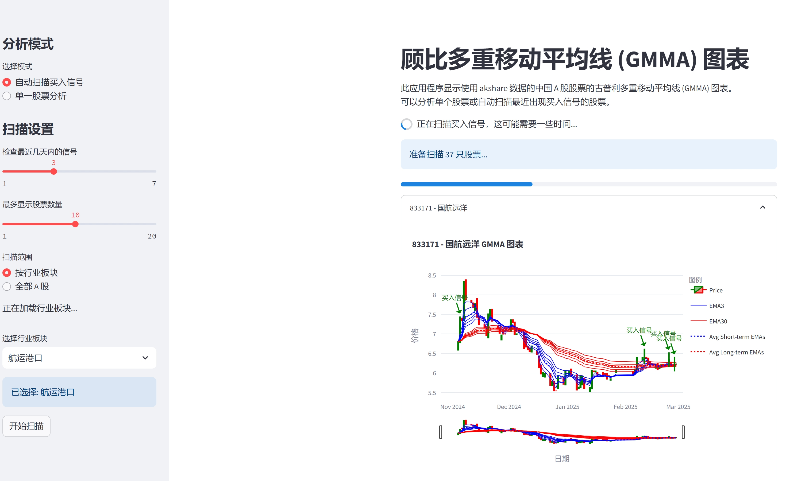

# GMMA 股票分析工具

这是一个基于 Streamlit 的股票分析工具，使用 Guppy Multiple Moving Average (GMMA) 技术来识别买入信号。它支持分析 A 股、ETF 和港股。

## 📊 功能特点

- **GMMA 计算和可视化：** 计算短期和长期 EMA，识别交叉（买入信号），并在 Streamlit 应用中使用 Plotly 图表显示数据。
- **单一股票分析：** 用户可以通过提供股票代码来分析个股。该应用显示详细的 GMMA 图表并突出显示买入信号。
- **自动扫描：** 用户可以自动扫描市场中近期出现买入信号的股票，可以按行业筛选（A 股）或扫描整个市场。ETF 扫描器侧重于一组特定的 ETF。港股扫描器扫描主板市场。

## 🚀 安装指南

1. **克隆仓库**

   ```bash
   git clone https://github.com/your-username/gmma_auto_decision.git
   cd gmma_auto_decision
   ```

2. **创建虚拟环境 (推荐)**

   ```bash
   python3 -m venv .venv
   source .venv/bin/activate
   ```

3. **安装依赖**

   ```bash
   pip install -r requirements.txt
   ```

## 💻 运行应用

### A 股分析

```bash
streamlit run gmma_akshare.py
```

### ETF 分析

```bash
streamlit run gmma_etf_akshare.py
```

### 港股分析

```bash
streamlit run gmma_hk_akshare.py
```


## 📝 使用说明

### gmma_akshare.py (A 股)

**单一股票分析:**

1. 在左侧边栏选择“单一股票分析”模式。
2. 输入 6 位股票代码（例如：000001 代表平安银行）。
3. 选择是否显示短期 EMA 和长期 EMA。
4. 系统将自动加载并分析该股票的 GMMA 数据。
5. 图表上用绿色垂直线标记买入信号（短期 EMA 从下方穿过长期 EMA）。

**自动扫描买入信号:**

1. 在左侧边栏选择“自动扫描买入信号”模式。
2. 设置扫描参数：
    - 检查最近几天内的信号（1-7 天）。
    - 最多显示股票数量（1-200 只）。
    - 选择扫描范围（全部 A 股或按行业板块）。
3. 如果选择按行业板块，从下拉菜单中选择感兴趣的行业。
4. 点击“开始扫描”按钮。
5. 系统将自动扫描并显示符合条件的股票列表和详细图表。


### gmma_etf_akshare.py (ETF)

1. 在左侧边栏选择 "指定基金分析" 或 "基金全扫描" 模式。
2. 选择卖出信号比较的短期 EMA (EMA3, EMA5, EMA8, EMA10)。
3. 如果选择 "指定基金分析"，请输入基金代码。
4. 系统将显示 ETF 的 GMMA 图表，以及买入和卖出信号。
5. "基金全扫描" 模式会扫描所有支持的 ETF，并显示符合条件的 ETF 列表。


### gmma_hk_akshare.py (港股)

**单一股票分析:**

1. 在左侧边栏选择“单一股票分析”模式。
2. 输入港股代码。
3. 系统将自动加载并分析该股票的 GMMA 数据。
4. 图表上用绿色垂直线标记买入信号（短期 EMA 从下方穿过长期 EMA）。

**自动扫描买入信号:**

1. 在左侧边栏选择“自动扫描买入信号”模式。
2. 设置扫描参数：
    - 检查最近几天内的信号（1-7 天）。
    - 最多显示股票数量（1-200 只）。


## 📈 GMMA 指标说明

GMMA (Guppy Multiple Moving Average) 是由澳大利亚交易员 Daryl Guppy 开发的技术分析工具，使用多条指数移动平均线 (EMA) 来分析市场趋势：

- **短期均线组：** 由 3、5、8、10、12、15 日 EMA 组成，反映短期交易者行为。
- **长期均线组：** 由 30、35、40、45、50、60 日 EMA 组成，反映长期投资者行为。

当短期均线从下方穿过长期均线时，通常被视为买入信号。

## 📦 依赖项

- **必需：** `streamlit`, `akshare`, `pandas`, `plotly`, `numpy`
- **可选：** `pyarrow` (用于性能优化)

```bash
pip install streamlit akshare pandas plotly numpy pyarrow
```


## 🌰 代码示例 (Python)

### gmma_akshare.py

```python
import gmma_akshare as gmma

# 分析单只股票
crossover, data = gmma.has_recent_crossover("000001")
if crossover:
    print(f"000001 出现交叉信号")

# 扫描市场
signals = gmma.scan_for_signals(days_to_check=3, max_stocks=10)
print(signals)
```

### gmma_etf_akshare.py

```python
import gmma_etf_akshare as gmma

# 分析单只ETF
crossover, data = gmma.has_recent_crossover("510050", ema_for_sell="EMA5")
if crossover:
    print(f"510050 出现交叉信号")

# 回测
results = gmma.perform_back_testing(data)
print(results)

```
### gmma_hk_akshare.py


```python
import gmma_hk_akshare as gmma

# 分析单只港股
crossover, data = gmma.has_recent_crossover("00700", market="HK")
if crossover:
    print(f"00700 出现交叉信号")

# 扫描市场
signals = gmma.scan_for_signals(days_to_check=3, max_stocks=10, market="HK")
print(signals)
```


## 📸 应用界面



*GMMA 应用界面 - 显示股票 GMMA 交叉买入信号分析*


## 🔍 注意事项

- 该应用仅供参考，不构成任何投资建议。
- 投资有风险，需谨慎决策。
